<h1 align="center">Maven</h1>

<p align="center">
  <b>Real-time, voice-based mock interviews.</b><br/>
  Talk to a low-latency voice interviewer that takes clean turns and asks adaptive
  follow-ups, run a live coding round, and get a rubric-scored report with the full transcript.
</p>

<p align="center">
  <a href="https://github.com/sparsh-j01/maven-ai/actions/workflows/ci.yml"></a>
  
  
  
  
  
</p>

## Why this exists

Most "AI interview" demos are a text box wired to a chat completion. Maven is
built the way a production voice product actually is: a long-lived stateful voice
worker separate from the serverless web app, a turn-based audio pipeline over
WebRTC, a state machine driven by tool-use, and an async scoring job that grades
the transcript after the call. The interesting engineering is the real-time loop
and the rigor of the scoring, not the UI.

|  |  |
| --- | --- |
|  |  |
| **The live room.** Push-to-talk, live transcript, the interviewer's state (listening / thinking / speaking) on the orb. | **The report.** Rubric-scored, with model answers for the weak responses and the full transcript. |
|  |  |
| **The coding round.** Monaco beside the voice panel; the agent runs your code in a sandbox and grades it against hidden cases. | **The dashboard.** Usage against your plan, score trend, and every past interview. |

## Highlights

- **Turn-based voice pipeline** (STT → LLM → TTS) over LiveKit/WebRTC.
  Push-to-talk with manual turn control and no barge-in: the candidate's turn
  ends when they release the mic, so pausing mid-answer to think never cuts them
  off. Clean turn ownership that stays reliable on flaky connections.
- **Provider adapters + a model gate.** STT, LLM, and TTS models come from one
  config (env vars; `packages/shared/src/models.ts` + `apps/agent/models.py`), so
  swapping a model is a config change — and the scorer model is proven "good
  enough" by the eval before it ships. See [Swapping a model](#swapping-a-model).
- **State machine + tool-use** drives the interview through phases
  (`intro → warmup → technical → coding → behavioral → wrap_up`). The interview
  cursor is persisted, so an agent restart resumes where it left off.
- **A real coding round.** Monaco in the browser, code executed in a sandboxed
  Judge0 runner (no network, hard CPU/memory/wall-clock limits), graded against
  **multiple hidden test cases** the candidate never sees — passing one example
  isn't passing. The agent runs it via a `run_code` tool mid-conversation, so the
  interviewer can react to what you wrote.
- **Async scored reports.** The interview ends instantly; a durable background
  job grades each rubric competency with structured output and drafts model
  answers for weak responses. A transcript-quality floor (`transcriptIsThin`)
  flags reports built on too little signal instead of inventing a confident score.
- **A scorer you can trust.** The feedback grader is measured, not assumed — an
  eval harness proves it distinguishes a good answer from a fluent wrong one, on
  the exact model that ships. See [Evaluating the scorer](#evaluating-the-scorer).
- **RAG personalization.** Resume + role embedded and matched against a curated
  question bank (Postgres + pgvector) so questions stay grounded.
- **Billing.** Free (3 fully-tailored interviews/mo) vs Pro (unlimited), monthly
  or annual (≈3 months free), via Razorpay (test mode for now). Region is
  auto-detected by IP for display pricing; every region checks out via Razorpay.
- **Request-gated interviews + an ops dashboard.** A candidate can set up an
  interview and generate its plan for free, but the costly live voice session
  (LiveKit + STT + LLM + TTS) only starts after an admin approves the request — a
  hard spend gate at the choke point. `/admin` (allowlisted by Clerk user id, 404s
  for everyone else) is where that happens: pending / in-flight / completed / average
  score across all users, the approval queue, and a live activity feed.

## Evaluating the scorer

The feedback report is only as good as the model grading it, and "the scores look
reasonable" is not a test. This project treats the scorer as something to be
measured, not trusted — with a harness (`packages/evals`) that proves the grader
distinguishes a *good answer* from a *fluent wrong one*, on the exact model that
ships.

### The problem a naive eval misses

The first version of this suite had three hand-written transcripts (strong, weak,
mixed) and checked that each landed in an expected score band. It passed 3/3 — and
measured nothing. A scorer that simply counts words passes all three, because the
strong candidate talks the most and the weak one talks the least. Length and
score were correlated, so the suite couldn't tell a real grader from a word
counter.

The fix was to build cases where **fluency and correctness point in opposite
directions**:

- `long-confident-wrong` — the *longest* transcript, articulate and confident,
  with four planted technical errors (e.g. claiming `INCR` + `EXPIRE` are atomic
  as a pair). Must score *lowest* on correctness.
- `short-hesitant-right` — the *shortest* transcript, full of hedging, that
  reaches the optimal solution. Must score *high* on correctness.

No word-count or hedge-count heuristic can satisfy both. A dedicated sanity check
(`pnpm eval:sanity`) runs a deliberately dumb word-count scorer against the suite
and asserts it is **rejected** — so the suite can never silently degrade into one
that measures verbosity.

### Three axes, not one score

A single 0–100 score can't separate "wrong but fluent" from "right but can't
explain it" from "honest but incomplete." The grader emits three independent axes:

- **correctness** — were the claims true? Scored as `100 − 20 × (false claims)`,
  where the model must first list every technical claim and mark it true/false.
  Anchoring the score to a *count* rather than a judgment makes it stable.
- **completeness** — did the candidate reach the answer? Scored as
  `(components produced ÷ total) × 100` against the ideal answer's components.
- **deliveryScore** — how clearly it was delivered, independent of whether it was
  right.

### Grading the reasoning, not just the number

A low score for the wrong reasons is not a correct grader. The suite asserts on
the model's *claim audit*, not just its output:

- The grader must catch the *planted* errors, not invent different ones.
- It must not flag a correct claim as false ("fail open protects availability" is
  right; "fail closed protects availability" is wrong — the grader must tell them
  apart by the proposition, not the shared vocabulary).
- Every claim it quotes must be **verbatim** from the transcript — a plain-code
  check that catches the model fabricating a claim and penalizing a candidate for
  words they never said.

### Determinism

Grading runs at `temperature: 0` — in the eval *and in production*, from one
shared setting (`SCORER_TEMPERATURE`), so the eval measures exactly what ships
and scores are reproducible. Any axis that drifts run-to-run is re-anchored to a
countable rule until it's stable.

```bash
pnpm eval:sanity   # assert a word-count scorer is REJECTED (no API key needed)
pnpm test          # standing tests: fakes behave, no API calls
pnpm eval:live     # the real grader through every assertion (~5 API calls)
pnpm eval          # live spot-check: prints scores + a prompt-injection resistance check
```

## Swapping a model

Every model id lives in one place — env vars, read by
`packages/shared/src/models.ts` (TS: scorer, plan, résumé) and
`apps/agent/models.py` (Python agent: LLM, STT, TTS). Change a model without
touching code, and prove it's good enough *before* it ships:

```bash
# try a candidate scorer model — the eval reads the same SCORER_MODEL the app does
SCORER_MODEL=gemini-2.5-pro pnpm eval:live   # the guarded gate: must pass every assertion
SCORER_MODEL=gemini-2.5-pro pnpm eval        # eyeball scores + injection resistance
```

Because the scorer id **and** temperature feed both production and the eval, a
green `eval:live` means the candidate model grades the golden transcripts
correctly. Run it a few times (an LLM number is only trustworthy once it's stable
across runs). If it passes, set `SCORER_MODEL` in the deploy env — no code change.
Agent-side models (`AGENT_LLM_MODEL` / `STT_MODEL` / `TTS_MODEL`) swap the same
way; verify those in a live interview rather than the scorer eval.

## Architecture

Three runtimes, split on purpose: the web app is request/response and
serverless-friendly; the voice agent is a long-lived worker that holds an audio
session open for minutes. It can't run on Vercel, so it doesn't.

<p align="center">
  
</p>

Secrets never reach the browser: it only ever gets a short-lived, room-scoped
LiveKit token. All third-party calls go through the BFF or the agent.

## Tech stack

| Layer | Choice |
| --- | --- |
| Web / BFF | Next.js 15 (App Router), React 19, TypeScript, Tailwind |
| Auth | Clerk |
| Realtime | LiveKit (WebRTC) |
| Voice agent | Python, LiveKit Agents (STT → LLM → TTS, push-to-talk turns) |
| LLM / STT / TTS | Gemini Flash / Deepgram (nova-3, en-IN) / Deepgram Aura (behind adapters) |
| Data | Postgres + pgvector, Drizzle ORM |
| Storage | Cloudflare R2 (audio + resumes) |
| Async | Inngest |
| Billing | Razorpay (monthly/annual) — test mode for now |
| Code sandbox | Judge0 — hosted CE (free tier) or self-hosted |
| Observability | Langfuse, Sentry, PostHog |

## Monorepo layout

```
apps/
  web/        Next.js app + BFF route handlers (deploys to Vercel)
  agent/      Python LiveKit Agents worker (the interviewer) — Dockerfile + fly.toml
packages/
  db/         Drizzle schema + migrations (Postgres + pgvector)
  shared/     shared TypeScript types + zod schemas (rubric, interview plan)
  evals/      golden-transcript eval harness for the feedback scorer
infra/
  db/         local Postgres init (enables pgvector)
```

## Getting started

**Requirements:** Node 22.13+ (pnpm 11 needs it), pnpm 11, Docker (for local
Postgres), Python 3.9+ for local agent dev (prod pins 3.12 — see the agent
`Dockerfile`).

The app runs as four processes in development: local infra (Docker), the web app,
the voice agent, and the async job runner (Inngest).

```bash
pnpm install
pnpm bootstrap              # create .env (linked into apps/web + packages/db)
# → open .env and fill in keys (Clerk + DATABASE_URL to start)
docker compose up -d        # local Postgres (pgvector)
pnpm db:push                # apply the schema
pnpm dev                    # run the web app
```

Then, in separate terminals, start the voice agent and the async job runner:

```bash
# voice agent (joins each interview room via LiveKit Cloud)
cd apps/agent && .venv/bin/python main.py dev

# async report runner (point -u at the web app's actual port)
INNGEST_DEV=1 npx inngest-cli@latest dev -u http://localhost:3000/api/inngest
```

### Commands

| Command | What it does |
| --- | --- |
| `pnpm bootstrap` | Create `.env` and link it into `apps/web` + `packages/db` |
| `pnpm dev` | Run apps in dev (Turborepo) |
| `pnpm build` | Build all packages |
| `pnpm lint` / `pnpm typecheck` | Lint / type-check |
| `pnpm test` | Run tests (vitest) |
| `pnpm eval:sanity` | Assert a word-count scorer is rejected by the eval suite (no API key needed) |
| `pnpm eval:live` | Run the real grader through every eval assertion (requires `GOOGLE_API_KEY`) |
| `pnpm db:generate` | Generate SQL migrations from the schema |
| `pnpm db:push` | Push the schema straight to the database |

## Deploying

Three runtimes deploy separately:

- **Web / BFF → Vercel.** Standard Next.js deploy; set the env vars from
  `.env.example` (Clerk, `DATABASE_URL`, LiveKit, Razorpay, `ADMIN_USER_IDS`, …).
  Point the Razorpay webhook at `https://<host>/api/webhooks/razorpay`.
- **Voice agent → Fly.io.** A long-lived worker (no inbound HTTP; it dials out to
  LiveKit), so it can't run on Vercel. `apps/agent` ships a `Dockerfile`
  (Python 3.12) and `fly.toml`; deploy with `fly deploy` and set secrets with
  `fly secrets set` (see the fly.toml header for the list). Keep one machine
  always-on — there's no request to wake it.
- **Judge0 (coding sandbox).** Cheapest launch path is hosted Judge0 CE on
  RapidAPI (free tier ≈ 50 calls/day — plenty, since interviews are
  admin-approved): set `JUDGE0_URL` + `JUDGE0_RAPIDAPI_KEY`. Self-host on Fly for
  scale (use `JUDGE0_AUTH_TOKEN` instead).
- **Postgres → Neon**, **async jobs → Inngest Cloud**. The scorer eval
  (`pnpm eval:live`) is a manual gate — it needs a paid API key, so it's run
  before a model change, not in CI.

## Security

- **BFF boundary** — the browser never holds provider keys or the LiveKit
  secret, only a short-lived room-scoped token.
- **Authorization** — every interview/report query is scoped to the
  authenticated user. No cross-user reads.
- **Sandboxed code execution** — the coding round runs untrusted code in an
  isolated sandbox with no network and hard CPU/memory/wall-clock limits, never
  in the agent process.
- **Spend caps** — nothing metered runs before an admin approves the request. Both
  the live voice session (the priciest path) and the LLM that generates the question
  plan sit behind that gate, so an unapproved request costs one database row and no
  API credits. On top of that: every interview is hard-capped at 10 minutes of
  wall-clock (the voice loop auto-ends and the room is torn down), the coding sandbox
  is bounded per submission (25 runs, 20 KB), and each account can only hold a few
  requests in the approval queue at once (3 free / 10 Pro). That last limit is a
  ceiling rather than a rate — it is released by an admin approving something, never
  by waiting — and it is enforced under a per-user advisory lock, so concurrent
  requests queue instead of all passing the same pre-insert count.
- **Security headers + CSP** — an enforced Content-Security-Policy (script-src
  pinned to self + the Clerk origin), plus `X-Frame-Options: DENY`, HSTS, and
  `nosniff`, set once in `next.config.ts`.
- **Prompt-injection defense** — candidate résumé/JD text is injected as clearly
  delimited *data* (the model is told to ignore instructions inside it) and the
  generated plan is grounded to the curated question bank, so a hijacked or
  malformed model response degrades to the deterministic plan.
- **Webhooks are signature-verified** — the Razorpay billing webhook
  authenticates by timing-safe HMAC signature (it is not Clerk-protected).
- **Premium content is gated server-side** — the Pro study plan is never
  generated for free users (dropped from the prompt and response schema, so no
  tokens are spent) and never sent to the browser; the free report renders a
  static decoy, so it cannot be revealed by stripping CSS.

## Contributing

[CONTRIBUTING.md](CONTRIBUTING.md) covers the four-process dev stack, the checks that
must be green before a push (including when the scorer eval becomes mandatory), and
where to add a question, a coding problem, or a rubric change.
[CHANGELOG.md](CHANGELOG.md) tracks what shipped in each milestone.

## Build log

Built and in place:
1. ✓ Monorepo scaffold, DB schema, auth, dashboard shell
2. ✓ LiveKit token minting + room join + text echo agent
3. ✓ Real voice loop: push-to-talk (manual turn control), STT → LLM → TTS, reconnect handling
4. ✓ Interview state machine + tools + question bank + plan generation
5. ✓ End → async feedback report + rubric radar + transcript
6. ✓ Coding round (Monaco + sandbox + run_code)
7. ✓ Resume upload + RAG personalization
8. ✓ Billing (Razorpay) + entitlements, observability, evals, CI/CD
9. ✓ UI/UX polish (skeletons, transitions, empty/error states)
10. ✓ Launch hardening: Razorpay-only billing, admin-approved interview requests,
    single-source model config + eval gate, deploy artifacts (agent Docker/Fly,
    hosted Judge0), CI builds the web app + runs the Python grader tests

Next:
- Expand the eval suite beyond the current scoring axes (competency coverage, adversarial cases)
- Harden reliability (retry/backoff on external calls, cost instrumentation)
- Global card payments (Razorpay International or a second gateway) beyond test mode